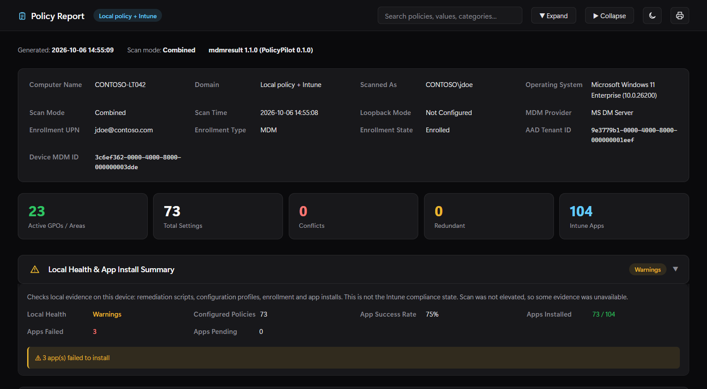
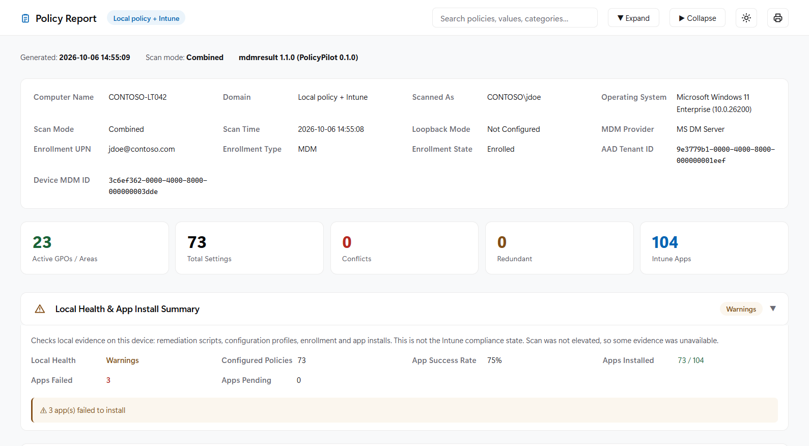
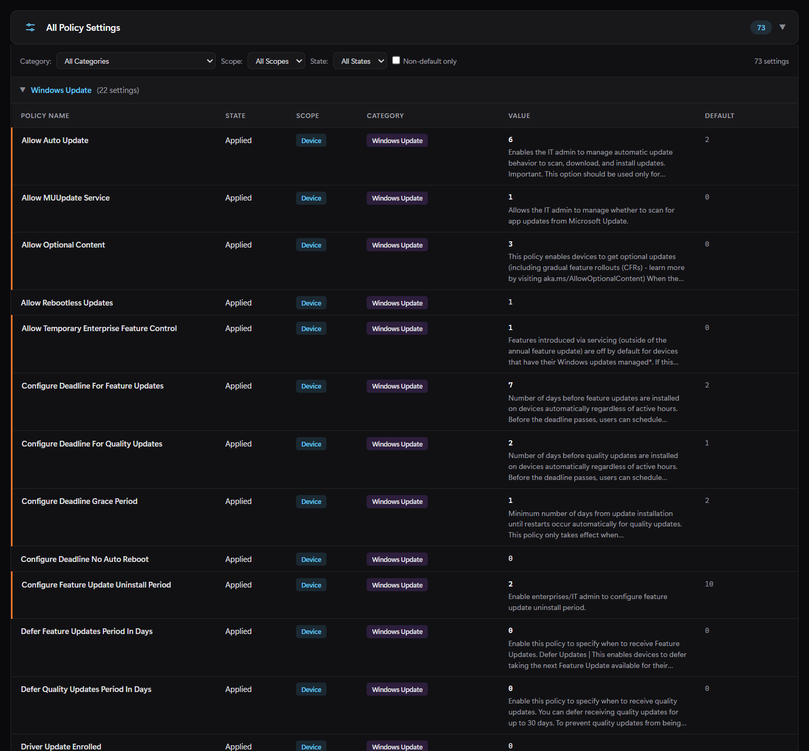
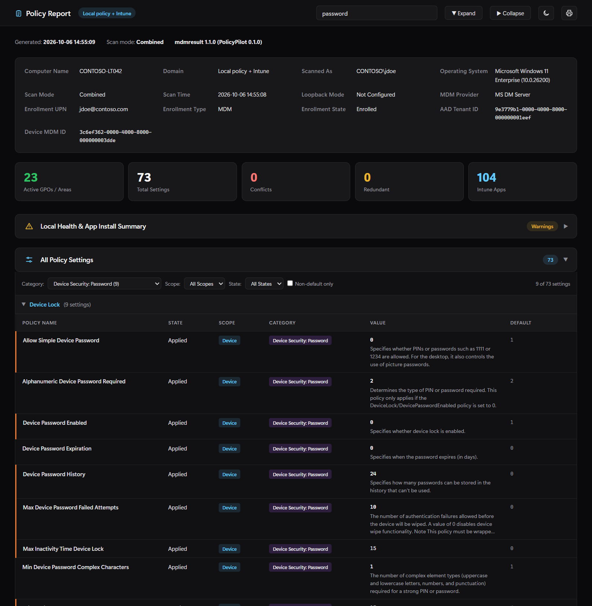
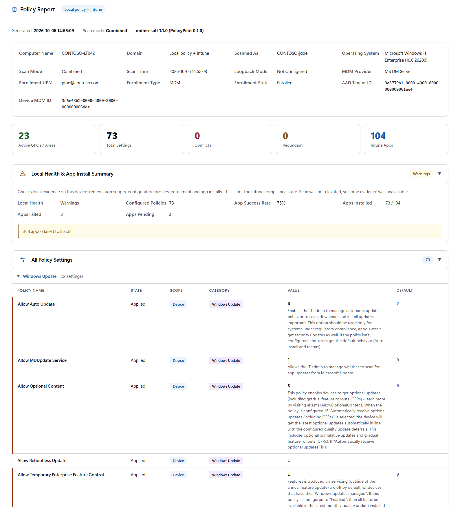

# mdmresult

gpresult for Intune and hybrid-managed Windows devices. One script and two metadata files;
copy the folder to a device, run it, get an HTML report.

The report is the same as PolicyPilot's **Export HTML**: Group Policy result and local MDM
policy state with English ADMX/CSP names and descriptions, CSP gap analysis, GPO conflicts,
Intune apps, certificates, LAPS, provisioning packages and a local health summary. The local
health summary checks evidence on the device (remediation scripts, configuration profiles,
enrollment, app installs); it is not the Intune compliance state.



| Light theme | Settings detail |
|---|---|
|  |  |
| **Filter and search** | **Print** |
|  |  |

Screenshots use placeholder identities (CONTOSO-LT042, jdoe@contoso.com).

## Package

| File | Purpose |
|---|---|
| `mdmresult.ps1` | The tool (PowerShell 5.1, no modules, no GUI) |
| `admx_metadata.json` | ADMX/ADML metadata: Windows 11 26H2 + SecGuide / MSS-legacy (3,726 policies), with German and French names for matching localized gpresult output |
| `csp_metadata.json` | Policy CSP metadata from Microsoft Learn (1,617 settings) |

`build/` is only needed to regenerate and test the package; don't ship it.

**Size and load time.** The package is about 17 MB on disk, almost all of it the ADMX
metadata (14 MB). The files are shipped uncompressed so the script runs as-is and the metadata
stays readable and diffable; zip the folder yourself if you need a smaller download. Loading
both metadata files takes about 2 seconds in Windows PowerShell 5.1.

## Usage

```powershell
# Combined Group Policy + MDM (default); run elevated
.\mdmresult.ps1

# Intune only, fixed paths, JSON for scripts, overwrite, open when done
.\mdmresult.ps1 -Mode Intune -Path C:\Temp\policy.html -JsonPath C:\Temp\policy.json -Force -Open
```

| Parameter | Default | Description |
|---|---|---|
| `-Mode` | `Combined` | `Local` (Group Policy), `Intune` (MDM), `Combined` (both; hybrid joined or co-managed devices) |
| `-Path` (`-H`) | `.\mdmresult_<COMPUTER>_<timestamp>.html` | Report file |
| `-JsonPath` | none | Also write a JSON summary: settings, conflicts, apps, local health |
| `-IncludeNotConfigured` | off | Add the catalogue of about 1,600 Policy CSP settings that are not configured (reference data, makes the report much larger) |
| `-Force` (`-F`) | off | Overwrite existing output files |
| `-Open` | off | Open the report when finished |

A gpresult `/r`-style summary is printed to the console; `-Verbose` shows the full scan log.

| Exit code | Meaning |
|---|---|
| `0` | Report written, nothing to review |
| `2` | Report written with findings: conflicts, local health warnings or issues, failed apps, or a failed Group Policy part |
| `1` | Error, no report |

## What it collects

- **Group Policy.** Elevated with a signed-in user, gpresult returns the computer *and* that
  user's results, like plain `gpresult`. Otherwise it falls back to computer scope, then user
  scope. Elevated runs also read the computer RSoP from WMI for registry paths and precedence.
- **Policy names.** Registry-based settings get English names from the ADMX metadata. Without
  elevation, gpresult reports names in the device's language; English, German and French
  names are matched by name and category (other languages: rebuild the metadata with
  `-NameLanguages`, see [PolicyPilot](../PolicyPilot/)).
- **Intune/MDM.** PolicyManager registry, MDM WMI bridge (elevated), `mdmdiagnosticstool.exe`
  (stopped after 180 s), Intune Management Extension logs and app state.

Without elevation, computer-scope Group Policy, the MDM WMI bridge and the Win32 app registry
are unavailable. The report is still produced and says so.

## Limitations

These come from PolicyPilot's scan code and apply to the GUI as well:

- **gpresult needs about 30-120 s.** If it fails or times out in Combined mode, the report
  still shows the Intune/MDM results with a banner, and the exit code is 2.
- User-scope Group Policy is the signed-in console user's. With nobody signed in (for example
  a remote SYSTEM session), only computer scope is reported.
- Policy names in languages other than English, German and French stay as reported by gpresult
  unless the metadata is rebuilt with those languages.

## Data handling

The report contains the computer and user name, enrollment UPN, policy values, installed
apps and certificate details; the JSON contains the same data. Treat both as internal.
gpresult output goes to a per-run folder under `%TEMP%` that is deleted after the scan, as is
the MDM diagnostics folder.

## Rebuilding

`mdmresult.ps1` is generated from [PolicyPilot](../PolicyPilot/). Don't edit it directly.

```powershell
.\build\Build-MdmResult.ps1
```

The build takes PolicyPilot's scan block, post-scan enrichment and gap analysis, conflict
detection and HTML report code from `PolicyPilot.ps1`, fills them into
`build/mdmresult.template.ps1`, and copies both metadata files from PolicyPilot. Run it after
any change to `PolicyPilot.ps1` or the metadata. It stops with an error if PolicyPilot's code
no longer has the expected shape, rather than generating a report that differs from the GUI.

## Testing

```powershell
# Offline: generated script parses, matches PolicyPilot.ps1 and the metadata, generator guards
powershell.exe -NoProfile -File .\build\Test-MdmResult.ps1

# Plus a real read-only Intune scan: HTML, JSON and exit code
powershell.exe -NoProfile -File .\build\Test-MdmResult.ps1 -Scan
```

PolicyPilot's own tests (conflict detection, name matching, report encoding, metadata
parsing) are in `..\PolicyPilot\Test-PolicyPilot.ps1`.
