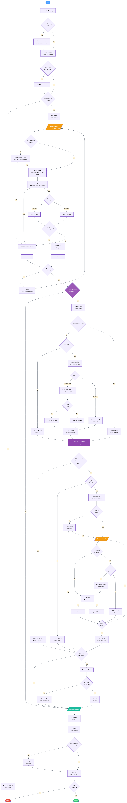

# Reset-Dot3SvcMigration

**Version:** 1.1
**Author:** Anton Romanyuk

> **Disclaimer:** This script is provided "as-is" without warranty of any kind, express or implied. Use at your own risk. The author assumes no liability for any damage or data loss resulting from its use. Always test in a non-production environment before deployment.

Iteratively resets the Wired AutoConfig (`dot3svc`) migration flag and restarts the service to ensure 802.1x wired profiles are correctly applied after a Windows in-place upgrade.

## Problem

During Windows in-place upgrades, the `dot3svc` service may fail to properly migrate wired authentication (802.1x) profiles. Common symptoms include:

- Wired 802.1x authentication stops working after upgrade
- The `dot3svcMigrationDone` registry flag is set prematurely, before the service fully initializes
- Policy files in the migration directory are replaced with broken symlinks pointing to the now-deleted previous Windows installation
- Hardware enumeration delays cause the service to miss network adapters on first start

## Solution

This script addresses the issue by:

1. **Resetting the migration flag** (`dot3svcMigrationDone = 0`) and restarting the service multiple times with configurable delays, giving the service time to discover hardware and re-apply profiles
2. **(Optional) Repairing policy files** — a disabled-by-default path for specific edge cases seen at customer environments, where migrated policy files are broken or missing and recoverable originals still exist in `C:\Windows.old`

## Parameters

| Parameter | Type | Default | Description |
|---|---|---|---|
| `MaxRetries` | `int` | `3` | Number of reset-and-restart iterations (1–10) |
| `RetryDelaySeconds` | `int` | `30` | Seconds to wait between iterations (5–120) |
| `LogDirectory` | `string` | `$env:SystemDrive\Windows\Temp` | Directory for the structured log file |
| `RepairPolicies` | `switch` | Off | Disabled by default. Use only for customer edge cases where migrated 802.1x policy files are missing or broken and matching originals exist in `C:\Windows.old`; enables symlink detection and Windows.old recovery. |
| `SkipSymlinkCheck` | `switch` | Off | Use only with `-RepairPolicies` in the same edge-case scenarios; skips the symlink detection phase. |

## Usage

### Basic — migration reset only

```powershell
.\Reset-Dot3SvcMigration.ps1
```

Runs 3 iterations with 30-second delays. Resets the registry flag and restarts `dot3svc` each time.

### Custom iteration count and delay

```powershell
.\Reset-Dot3SvcMigration.ps1 -MaxRetries 5 -RetryDelaySeconds 15
```

### Full repair — migration reset + policy recovery

```powershell
.\Reset-Dot3SvcMigration.ps1 -RepairPolicies
```

Use this only if the environment matches the failure pattern seen in some customer cases: migrated wired 802.1x policy files are missing or broken after upgrade, and the original files are still available under `C:\Windows.old`. This path is intentionally disabled by default.

After the migration reset loop, the script will:

1. **Symlink check** — Scan `%ProgramData%\Microsoft\dot3svc\MigrationData\Policies` for symlinks vs real files
2. **Windows.old recovery** — Look for `.tmp` policy files in `C:\Windows.old\Windows\dot3svc\Policies` and copy any that are **missing** from the active target directory (`C:\Windows\dot3svc\Policies`). Files that already exist as real files in the target are **not overwritten**.
3. **Service restart** — If any files were actually copied, restart `dot3svc` one more time

### Policy recovery without symlink check

```powershell
.\Reset-Dot3SvcMigration.ps1 -RepairPolicies -SkipSymlinkCheck
```

## How It Works

### Migration Reset Loop

Each iteration performs three steps:

1. **Ensure registry path** — Creates `HKLM:\SOFTWARE\Microsoft\dot3svc\MigrationData` if it doesn't exist
2. **Reset migration flag** — Sets `dot3svcMigrationDone` (DWORD) to `0`, signaling the service to re-run its migration logic
3. **Restart service** — Restarts `dot3svc` and waits up to 30 seconds for it to reach `Running` state

The delay between iterations accounts for slower hardware enumeration or service initialization.

### Policy Repair (when `-RepairPolicies` is set)

#### Phase 1 — Symlink Detection

Scans the migration Policies folder and classifies each file as a real file or a symlink/junction (reparse point). Broken symlinks — those pointing to targets in `C:\Windows.old` that no longer exist — are flagged as errors.

#### Phase 2 — Windows.old Recovery

For each `.tmp` policy file found in `C:\Windows.old\Windows\dot3svc\Policies`:

| Target file state | Action |
|---|---|
| **Missing** | Copy from Windows.old |
| **Symlink/junction** | Remove symlink, copy real file from Windows.old |
| **Real file exists** | **Skip** — no overwrite |

This ensures safe re-runs: if the target already has good data, the copy logic is a no-op.

#### Phase 3 — Post-Repair Restart

If any files were actually copied in Phase 2, the service is restarted one final time so it picks up the recovered policies.

## Execution Flow



> Diagram source: [`execution-flow.mmd`](execution-flow.mmd)

## Logging

The script produces dual output:

- **Console** — Color-coded messages (Cyan=INFO, Yellow=WARN, Red=ERROR, Green=SUCCESS, White=STEP)
- **Log file** — Structured timestamped entries at `<LogDirectory>\Dot3Svc_Fix_<yyyyMMdd_HHmmss>.log`

Each log entry follows the format:

```
[2026-04-15 10:30:45.123] [INFO] Service 'dot3svc' initial state: Running
```

## Exit Codes

| Code | Meaning |
|---|---|
| `0` | All iterations succeeded, no errors |
| `1` | Service not found, one or more iterations failed, or policy copy errors occurred |

## Requirements

- **Windows** — Requires the `dot3svc` (Wired AutoConfig) service to be installed
- **Administrator** — Registry writes and service restarts require elevation. The script warns if not running as admin but does not abort
- **PowerShell 5.1+** — Compatible with Windows PowerShell and PowerShell 7+

## Deployment

This script is designed to run as a **post-upgrade task**, typically via:

- SCCM/MECM Task Sequence (post-upgrade step)
- Intune Proactive Remediation or Platform Script
- Scheduled Task triggered on upgrade completion
- Manual execution during troubleshooting

## File Structure

```
windows/dot3svc/
├── Reset-Dot3SvcMigration.ps1   # Main script
├── execution-flow.png           # Execution flow diagram
├── execution-flow.mmd           # Mermaid diagram source
└── README.md                    # This file
```
